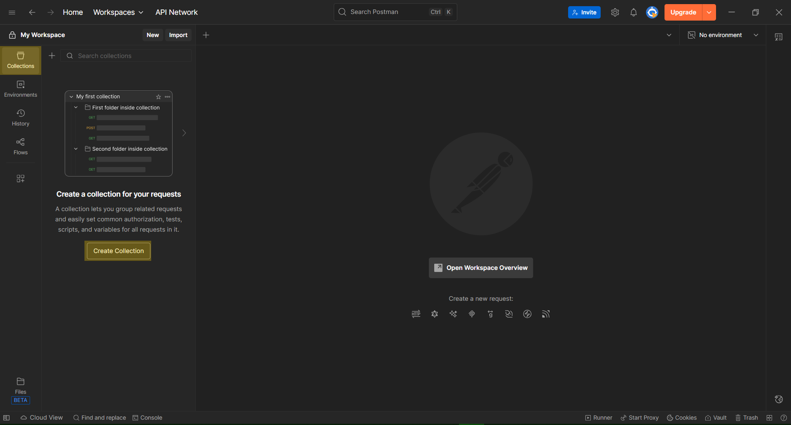
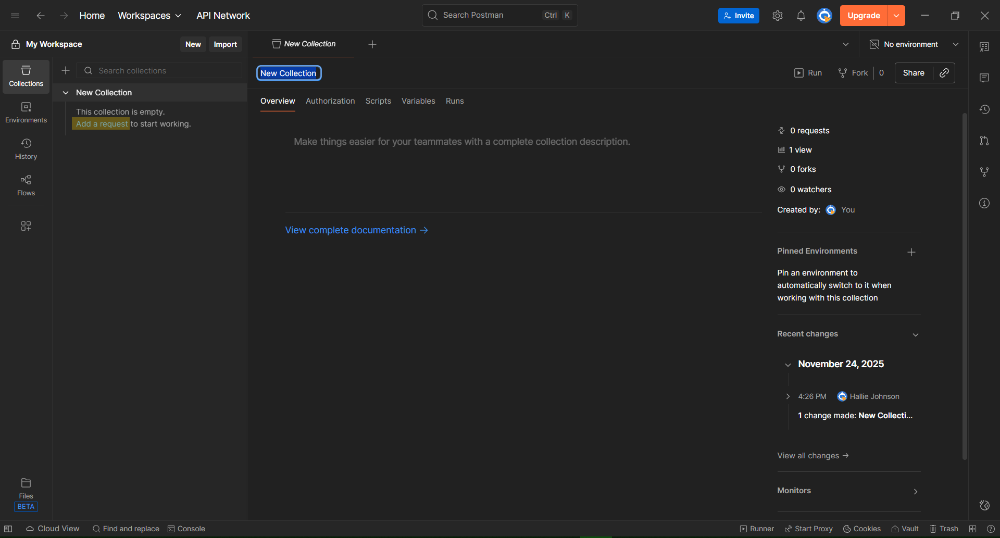
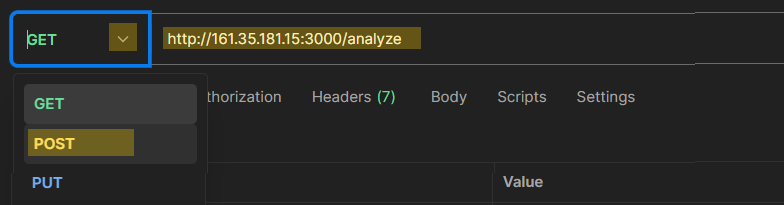
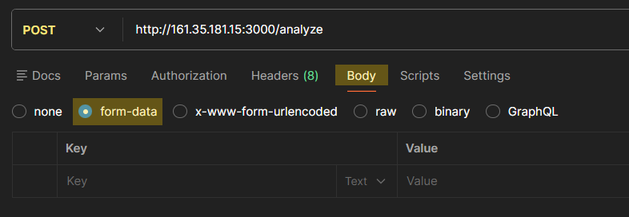
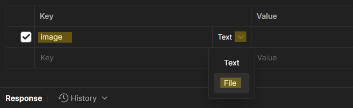

# Image Analysis API Documentation

## Table of Contents
- [Overview](#overview)
- [Prerequisites](#prerequisites)
- [Getting Started](#getting-started)
- [API Endpoint](#api-endpoint)
- [Results Breakdown](#results-breakdown)
- [Common Errors](#common-errors)
- [Code Samples](#code-samples)
- [Links](#links)

## Overview
The Image Analysis API allows users to use Postman to upload an image and receive the following from Azure AI Image Analysis resource:
- A caption describing the image
- Sub-captions to describe different parts of the image
- Get the height and width of the image
- Get tags on the image to identify objects, scenery, and humans in the image
- Get confidence values for Azure AI's predictions

Below is a diagram to visualize the process:


## Prerequisites

#### Install Postman
Postman is required to send images to this API.
- Download Postman: https://www.postman.com/
- Create a Postman account

#### Image File
You may upload any standard image file from your computer. Supported and unsupported file types are shown below:

| Acceptable Image Types | Unsupported Image Types |
| -------- | ------- |
| JPEG (.jpg, .jpeg) | SVG (.svg) |
| PNG (.png) | PDF (.pdf) |
| GIF (.gif) | Raw Camera Files (.cr2, .nef, .arw, etc.) |
| BMP (.bmp) | PSD (Photoshop) (.psd) |
| TIFF (.tif, .tiff) | HEIC/HEIF (iPhone) (.heic, .heif) |
| ICO (.ico) |  |
| WEBP (.webp) |  |
| MPO (.mpo) |  |

| Max File Size | Recommended Dimensions | Image Count |
| -------- | ------- | ------- |
| 20 MB | 50x50 px - 16,000x16,000 | Only 1 image per request |


## Getting Started
Follow the tutorial GIF below or use the steps provided.


### Step-by-Step Instructions


#### 1. Open Postman.


#### 2. Click on *Collections* in the left-hand sidebar. Click *Create Collection*.


#### 3. Click *Add a request*.


#### 4. The request now has the fields we need to input our request information.


#### 5. Change *GET* to *POST* using the dropdown. Type the URL: http://161.35.181.15:3000/analyze into the *Enter URL or paste text* field.


#### 6. Select *Body* and select *form-data*.


#### 7. Under the *Key* parameter, type *image* and select *File* in the type dropdown. 


#### 8. Under the *Value* parameter, click on *Select Files*. Click on *New file from local machine* and select an image on your system. 


#### 9. Verify the following has been inputted. Click *Send* to send the image to the API.
| Field | Value |
| -------- | ------- |
| Method | POST |
| URL | http://161.35.181.15:3000/analyze |
|  | Body |
|  | form-data |
| Key | image |
|  | File |
| Value | [Your image file] |
| Description | | 


#### 9.  The response returns a *200 OK* and returns image information based on the image you uploaded.


## API Endpoint
`POST /analyze`
### Request
- Required Field: `image` file

### Response
If successful, the response looks like:
```
{
    "modelVersion": "2023-10-01",\
    "captionResult": {
        "text": "a pixel art of a crown with sunglasses",
        "confidence": 0.8479525446891785
    },
    "denseCaptionsResult": {
        "values": [
            {
                "text": "a pixel art of a crown with sunglasses",
                "confidence": 0.8480708003044128,
                "boundingBox": {
                    "x": 0,
                    "y": 0,
                    "w": 1920,
                    "h": 363
                }
            },
            {
                "text": "a pixel art of a crown",
                "confidence": 0.8442812561988831,
                "boundingBox": {
                    "x": 804,
                    "y": 46,
                    "w": 305,
                    "h": 262
                }
            },
            {
                "text": "a yellow square object with black background",
                "confidence": 0.6711029410362244,
                "boundingBox": {
                    "x": 1013,
                    "y": 93,
                    "w": 57,
                    "h": 68
                }
            }
        ]
    },
    "metadata": {
        "width": 1920,
        "height": 363
    },
    "tagsResult": {
        "values": [
            {
                "name": "silhouette",
                "confidence": 0.7886707782745361
            },
            {
                "name": "design",
                "confidence": 0.5593554973602295
            }
        ]
    },
    "objectsResult": {
        "values": []
    },
    "readResult": {
        "blocks": []
    },
    "smartCropsResult": {
        "values": [
            {
                "aspectRatio": 5.27,
                "boundingBox": {
                    "x": 400,
                    "y": 45,
                    "w": 1440,
                    "h": 273
                }
            }
        ]
    },
    "peopleResult": {
        "values": [
            {
                "boundingBox": {
                    "x": 9,
                    "y": 4,
                    "w": 1908,
                    "h": 356
                },
                "confidence": 0.0013329751091077924
            }
        ]
    }
}
```

## Results Breakdown

## Common Errors

## Code Samples


## Links
