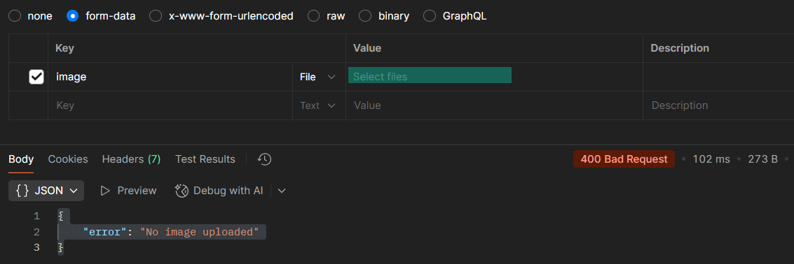
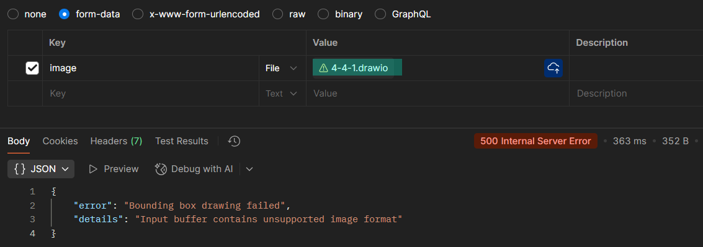
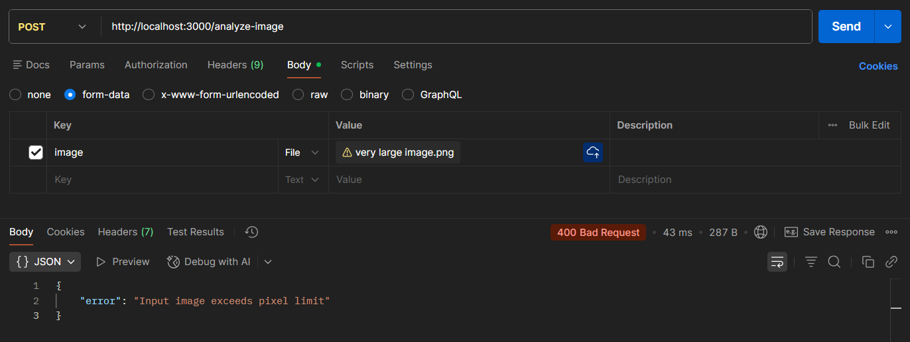

# Azure AI Image Analysis API Documentation
Hallie Johnson - ITIS 6177

<br></br>
----
## TABLE OF CONTENTS
- [Overview](#overview)
- [Use Cases](#use-cases)
- [Architecture Diagram](#architecture-diagram)
- [Prerequisites](#prerequisites)
- [Getting Started](#getting-started)
- [/Analyze Endpoint - Caption Generation](#analyze-endpoint---caption-generation)
- [/Analyze-Image Endpoint - Bounding Box Generation](#analyze-image-endpoint---bounding-boxes)
- [API Endpoints](#api-endpoints)
- [Results Breakdown](#results-breakdown)
- [Technical Explanation of Bounding Boxes](#technical-explanation-of-bounding-boxes)
- [Common Errors](#common-errors)
- [Links](#links)
<br> </br>
<br> </br>

----
## OVERVIEW
The Image Analysis API allows users to send images to Azure AI Image Analysis and receive:
- Captions describing the image
- Sub-captions for individual sections of the image
- Bounding boxes for objects, people, and sub-captions
- Tags identifying objects, scenery, and humans
- Confidence scores for predictions

The API provides two endpoints:
1. `/analyze` - returns JSON metadata and analysis results
2. `/analyze-image` - returns the original image with bounding boxes drawn and labeled
<br> </br>
<br> </br>

----
## USE CASES
This API provides automated image analysis for applications like:
- Content moderation
- Accessibility (alt-text)
- Object detection for security
- Data tagging for image datasets
- Visual insights for marketing and media analysis
<br> </br>
<br> </br>

----
## ARCHITECTURE DIAGRAM
Below is a diagram showing how the API works:


<br> </br>
<br> </br>

----
## PREREQUISITES

#### Install Postman
Postman is required to send images to this API.
- Download Postman: https://www.postman.com/
- Create a Postman account
<br> </br>

#### Image File
You may upload any standard image file from your computer. Supported and unsupported file types are shown below:

| Acceptable Image Types | Unsupported Image Types |
| -------- | ------- |
| JPEG (.jpg, .jpeg) | SVG (.svg) |
| PNG (.png) | PDF (.pdf) |
| GIF (.gif) | Raw Camera Files (.cr2, .nef, .arw, etc.) |
|  | PSD (Photoshop) (.psd) |
|  | HEIC/HEIF (iPhone) (.heic, .heif) |
|  | BMP (.bmp) |
|  | ICO (.ico) |
<br> </br>

| Max File Size | Recommended Dimensions | Image Count |
| -------- | ------- | ------- |
| 20 MB | 50x50 px to 16,000x16,000 | Only 1 image per request |
<br> </br>
<br> </br>

----
## GETTING STARTED
Complete the following steps to use the API or use the [Postman Documentation](https://learning.postman.com/docs/sending-requests/requests/) to learn more:

#### 1. Open Postman.

<br> </br>

#### 2. Click on *Collections* in the left-hand sidebar. Click *Create Collection*.

<br> </br>

#### 3. Click *Add a request*.

<br> </br>

#### 4. The request now has the fields we need to input our request information.

<br> </br>
<br> </br>
<br> </br>

----
## /analyze ENDPOINT - CAPTION GENERATION
Follow the tutorial GIF below or use the steps provided.


### Step-by-Step Instructions

#### 1. Change *GET* to *POST* using the dropdown. Type the URL: http://161.35.181.15:3000/analyze into the *Enter URL or paste text* field.

<br> </br>

#### 2. Select *Body* and select *form-data*.

<br> </br>

#### 3. Under the *Key* parameter, type *image* and select *File* in the type dropdown. 

<br> </br>

#### 4. Under the *Value* parameter, click on *Select Files*. Click on *New file from local machine* and select an image on your system. 

<br> </br>

#### 5. Verify the following has been inputted. Click *Send* to send the image to the API.
| Field | Value |
| -------- | ------- |
| Method | POST |
| URL | http://161.35.181.15:3000/analyze |
|  | Body 
|  | form-data |
| Key | image |
|  | File |
| Value | [Your image file] |
| Description | | 


<br> </br>

#### 6.  The response returns a *200 OK* and returns image information based on the image you uploaded.

<br> </br>
<br></br>
<br> </br>

----
## /analyze-image ENDPOINT - BOUNDING BOXES
Follow the tutorial GIF below or use the steps provided.


<br> </br>

### Step-by-Step Instructions

#### 1. Change *GET* to *POST* using the dropdown. Type the URL: http://161.35.181.15:3000/analyze-image into the *Enter URL or paste text* field.

<br> </br>

#### 2. Select *Body* and select *form-data*.

<br> </br>

#### 3. Under the *Key* parameter, type *image* and select *File* in the type dropdown. 

<br> </br>

#### 4. Under the *Value* parameter, click on *Select Files*. Click on *New file from local machine* and select an image on your system. 

<br> </br>

#### 5. Verify the following has been inputted. Click *Send* to send the image to the API.
| Field | Value |
| -------- | ------- |
| Method | POST |
| URL | http://161.35.181.15:3000/analyze-image |
|  | Body 
|  | form-data |
| Key | image |
|  | File |
| Value | [Your image file] |
| Description | | 


<br> </br>

#### 6.  The response returns your a *200 OK* status and the image you uploaded with bounding boxes and labels.

<br> </br>
<br> </br>
<br> </br>


----
## API ENDPOINTS
### POST `/analyze`
**Description**: Returns JSON metadata about the image, including captions, tags, and detected objects.

**Request**:
- Method: POST
- URL: http://161.35.181.15:3000/analyze
- Body: `form-data`
- Key: `image`
- Type: `File`
- Value: Your image file

**Response**:
```
{
    "modelVersion": "2023-10-01",
    "captionResult": { "text": "A crown with sunglasses", "confidence": 0.84 },
    "denseCaptionsResult": {
        "values": [
            { 
                "text": "A crown", 
                "confidence": 0.84, 
                "boundingBox": { 
                    "x": 804, 
                    "y": 46, 
                    "w": 305, 
                    "h": 262 
                } 
            }
        ]
    },
    "metadata": { 
        "width": 1920, 
        "height": 363 
    },
    "tagsResult": { 
        "values": [ 
            { 
                "name": "silhouette", 
                "confidence": 0.78 
            } 
        ]
    },
    "objectsResult": { 
        "values": [] 
    },
    "peopleResult": { 
        "values": [] 
    }
}
```

### POST `/analyze-image`
**Description**: Returns the original image with bounding boxes drawn around objects, dense captions, and detected people.

**Request**:
- Method: POST
- URL: http://161.35.181.15:3000/analyze-image
- Body: `form-data`
- Key: `image`
- Type: `File`
- Value: Your image file

**Response**:
- Content-Type: `image/png`
- The image will have red rectangles and labels over detected regions.
- If no bounding boxes are detected, the original image is returned.

<br> </br>

----
## RESULTS BREAKDOWN
| Feature | Description |
| -------- | ------- |
| Caption | Primary caption for the image |
| Dense Captions | Region-based sub-captions with bounding boxes |
| Objects | Detected objects with location |
| People | Bounding boxes around humans |
| Tags | Labels identifying objects, scenery, etc. |
| Metadata | Width and height of the image |
| Confidence | AI's confidence for each prediction |
| Smart Crops | Suggested crops for highlighting regions |

<br> </br>
<br> </br>

----
## TECHNICAL EXPLANATION OF BOUNDING BOXES
- Bounding boxes are objects with coordinates:
    - x, y - top-left corner
    - w, h - width and height
- Drawn as red rectangles with labels

<br> </br>
<br> </br>

----
## COMMON ERRORS

### No Image Uploaded


**Cause**: Image file missing in request.

**Solution**: Upload image and/or verify form-data is correct.

<br> </br>

### Bounding Box Drawing Failed - Input Buffer Contains Unsupported Image Format


**Cause**: Image file is an unsupported file.

**Solution**: Upload image with acceptable file format.

<br> </br>

### Input image exceeds pixel limit / Image too small. Minimum size is 50px.



**Cause**: Image file is too large or too small.

**Solution**: Upload image with an acceptable resolution.

<br> </br>
<br> </br>

----
## LINKS
- [Azure AI Image Analysis](https://azure.microsoft.com/en-us/products/ai-services/ai-vision/)
- [Azure AI Vision Image Analysis Documentation](https://learn.microsoft.com/en-us/javascript/api/overview/azure/ai-vision-image-analysis-rest-readme?view=azure-node-preview)
- [Postman](https://www.postman.com/)
- [Postman - Sending Requests Documentation](https://learning.postman.com/docs/sending-requests/requests/)